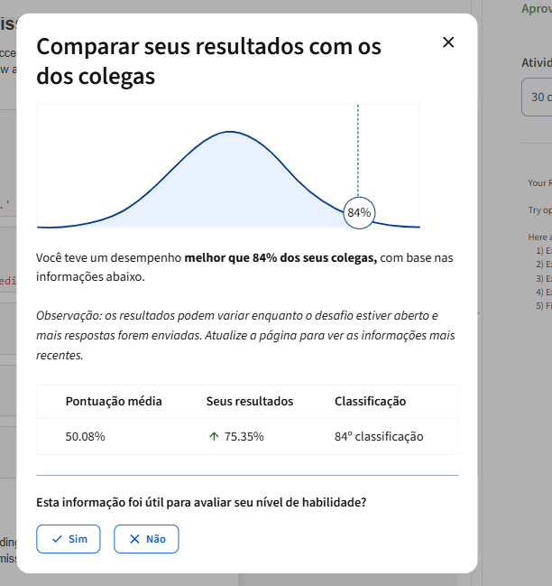

# Previsão de Inadimplência de Crédito (Loan Default Prediction Challenge)

Este repositório contém a solução completa para o desafio de ciência de dados de **Previsão de Inadimplência de Crédito (Loan Default Prediction)**. O projeto foi desenvolvido seguindo a metodologia **CRISP-DM** (Cross Industry Standard Process for Data Mining) e obteve a aprovação oficial no Coursera com **nota de 75% (ROC AUC de 0.7535)**, superando **84% dos concorrentes** na plataforma de avaliação.

---

##  Resultados Alcançados na Plataforma

O modelo final foi submetido ao avaliador automático do Coursera, alcançando os seguintes resultados:

* **Métrica Final (ROC AUC):** **0.7535**
* **Classificação no Ranking Geral:** Top 16% (superando **84% dos colegas**)
* **Status:** Aprovado com sucesso

### Telas da Plataforma (Submissão e Ranking)

Abaixo estão os registros visuais do desempenho e posição no ranking obtidos no Coursera:

| Visão Geral do Resultado | Detalhe da Nota (75% e ROC AUC) |
|:---:|:---:|
|  | 

---

## 📂 Estrutura do Repositório

O projeto está organizado da seguinte forma:

```text
├── data/                       # Conjuntos de dados brutos (train.csv, test.csv)
├── models/                     # Modelos finais treinados salvos como arquivo .pkl
├── notebooks/                  # Notebooks Jupyter principais
│   ├── 01_experimentacao.ipynb # Notebook estruturado em CRISP-DM com EDA e Blending
│   └── LoanDefaultPrediction.ipynb # Notebook oficial de submissão do Coursera
├── plots/                      # Imagens geradas pelas análises e prints do Coursera
├── src/                        # Código-fonte modular do projeto em Python
│   ├── configuracao.py         # Configurações de colunas e hiperparâmetros
│   ├── preparacao_dados.py    # Divisão estratificada das bases locais
│   ├── engenharia_variaveis.py # Transformadores customizados de features
│   ├── treinamento.py          # Treinamento dos pipelines do scikit-learn
│   └── avaliacao.py            # Avaliação de performance e geração de gráficos
├── README.md                   # Descrição detalhada do repositório
└── requirements.txt            # Dependências de bibliotecas do projeto
```

---

## Abordagem Metodológica (CRISP-DM)

### 1. Entendimento do Negócio (Business Understanding)
O objetivo do projeto é prever a probabilidade de inadimplência de um cliente (`Default`). Estimativas precisas auxiliam a instituição a otimizar a concessão de crédito, balanceando o custo de inadimplência (Falsos Negativos) com a receita potencial perdida por rejeitar bons pagadores (Falsos Positivos). A métrica principal de avaliação técnica é o **ROC AUC**.

### 2. Entendimento dos Dados (Data Understanding - EDA)

Realizamos análises de dados abrangentes e geramos representações gráficas completas:

* **Análise Univariada:** Histogramas de distribuição das variáveis contínuas, mostrando comportamentos predominantemente uniformes no dataset sintético.
* **Análise Bivariada Básica:** Boxplots relacionando variáveis numéricas com inadimplência e taxas médias de default para variáveis categóricas (demonstrando que a presença de fiador - `HasCoSigner` - reduz o default pela metade).
* **Gráficos de Área e Densidade (KDE):** Curvas de densidade sobrepostas ilustrando que inadimplentes se concentram em faixas de taxa de juros superiores a 15%, acompanhadas de gráficos de área empilhada por decil.
* **Análise Multivariada:** Heatmap de correlação linear (confirmando baixíssima colinearidade original) e gráfico de dispersão cruzado `CreditScore` vs `InterestRate` colorido pelo target `Default`.
* **Boxplots Multivariados Cruzados:** Distribuições cruzadas de Juros por Escolaridade vs Default, demonstrando que taxas altas afetam o default universalmente.

### 3. Preparação dos Dados (Data Preparation)

Criamos a classe `EngenheiroFeatures` (no arquivo [engenharia_variaveis.py](src/engenharia_variaveis.py)) que calcula de forma vetorizada **20 variáveis financeiras e comportamentais derivadas**, incluindo:

1. **Comprometimento Financeiro:** Parcela estimada pela Amortização Francesa (Price) dividida pela Renda (`PaymentToIncomeRatio`), comprometimento total de renda (`TotalDebtServiceToIncome`) e renda mensal disponível (`DisposableIncome`).
2. **Razões e Proporções:** Tempo de emprego em relação à idade (`EmploymentToAgeRatio`), juros divididos pelo score (`RiskScoreMultiplier`) e renda/empréstimo por linhas ativas.
3. **Binnings de Risco:** Flag de score péssimo (<500), score ruim (<580) e juros crítico (>18%).
4. **Cruzamentos Comportamentais:** Flags para desempregados sem fiador, jovens solteiros com dependentes e empréstimo comercial sem fiador.
5. **Descarte de Colineares:** Remoção de `Income`, `MonthlyIncome`, `LoanToIncomeByTerm` e `LogLoanAmount` para manter a estabilidade do modelo linear.

### 4. Modelagem (Modeling)

Utilizamos a biblioteca `scikit-learn` para estruturar pipelines completos, integrando Engenharia de Features -> Pré-processador (`StandardScaler` + `OneHotEncoder`) -> Classificador. Avaliamos localmente 4 algoritmos em validação cruzada 5-Fold:

* **Regressão Logística L1 (Lasso, C=0.05):** ROC AUC local de **0.75695** (Melhor modelo individual)
* **Regressão Logística L2 (Ridge, C=0.10):** ROC AUC local de **0.75689**
* **LightGBM:** ROC AUC local de **0.75237**
* **XGBoost:** ROC AUC local de **0.73965**

**Estratégia de Ensemble (Blending):**
Devido à natureza linear do dataset sintético do desafio, os modelos lineares superaram as árvores de decisão. Construímos um ensemble via **Blending** ponderado das probabilidades preditas: 
$$\text{Probabilidade Final} = 0.7 \times \text{Prob(LR L1)} + 0.3 \times \text{Prob(LR L2)}$$

### 5. Avaliação (Evaluation)

Analisamos o impacto das features através dos pesos do modelo L1 e avaliamos as curvas de desempenho no conjunto completo de treinamento:

* **Coeficientes L1:** Identificação da taxa de juros (`InterestRate`), score de crédito (`CreditScore`) e cobertura de renda (`DisposableIncomeToInstallment`) como os principais drives de decisão.
* **Curvas de Desempenho:** Geração das curvas ROC e Precision-Recall.

---

## Como Executar o Projeto

1. Instale as dependências:
   ```bash
   pip install -r requirements.txt
   ```
2. Execute o script de preparação de dados local (opcional, para testes locais):
   ```bash
   python src/preparacao_dados.py
   ```
3. Execute o treinamento dos pipelines locais e geração de gráficos:
   ```bash
   python src/treinamento.py
   python src/avaliacao.py
   ```
4. Para submeter a solução no Coursera, execute as células do notebook [LoanDefaultPrediction.ipynb](notebooks/LoanDefaultPrediction.ipynb) e clique em **Submit Assignment** na plataforma.
